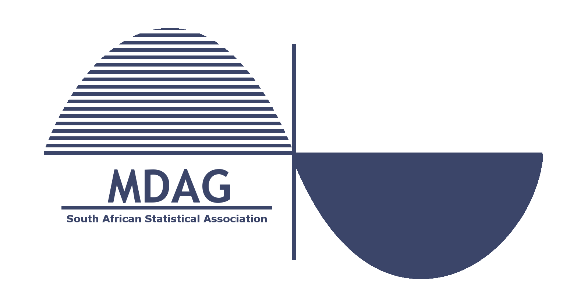

# Multivariate Data Analysis Group (MDAG) workshop

# Beyond multivariate applications: Quarto for reproducible interactive documents

This workshop will focus on aspects of the open-source scientific and technical publishing system, Quarto. Various output formats and best practices of each will be considered to firstly create static output for documents, followed by principles to adapt static documents to dynamic output such as HTML presentations. Strategies to optimally use qmd documents collaboratively with GitHub will be given. Finally, tips will be provided to construct personal websites using Quarto and GitHub with automatic updating capabilities.

**Organisers**: 

Sean van der Merwe, Raeesa Ganey and Johané Nienkemper-Swanepoel

## Target audience

- R users who would like to enhance their documents and presentations with interactive code and dynamic content.
- People who are interested in creating personal websites for academic purposes.

## Before the workshop

- Ensure that you have a recently updated version of R Studio on your laptop.
- Create a personal GitHub account before the workshop. Refer to <a href="https://github.com/MuViSU/SASA2025_MDAG/blob/main/Part4/Part4a_preparation.html" target="_blank">Part 4a</a>.

## Workshop programme

| Time | Topic | Presenter |
|------|-------|-------|
|09:00-09:45|	**Part 1** Background and possibilities | Sean |
|09:45-10:30|	**Part 2** Important details, specifications and examples | Sean |
|10:30-11:00|	|BREAK |
|11:00-11:45|	**Part 3** Hands-on practical examples for presentations | Sean and Johané |
|11:45-12:30|	**Part 4** Creating your own academic website | Johané | 

## Workshop Material

-    <a href="https://github.com/MuViSU/SASA2025_MDAG/tree/main/Part1and2" target="_blank">Part 1 and 2</a> - Sean van der Merwe
-    <a href="https://github.com/MuViSU/SASA2025_MDAG/tree/main/Part3" target="_blank">Part 3</a> - Raeesa Ganey
-    <a href="https://github.com/MuViSU/SASA2025_MDAG/tree/main/Part4" target="_blank">Part 4</a> - Johané Nienkemper-Swanepoel
